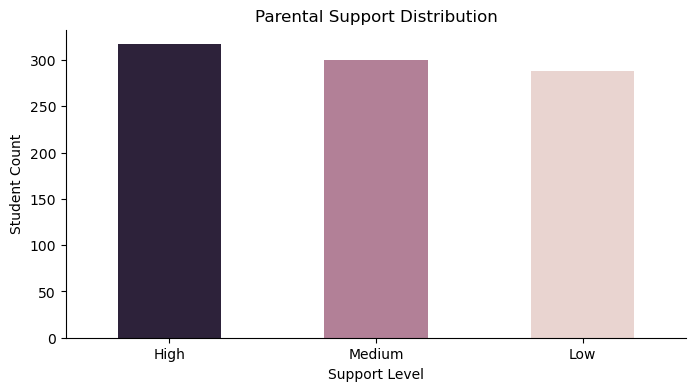

# Student Performance Analysis

## Project Overview

This project is an **Exploratory Data Analysis (EDA)** exercise focused on understanding the factors that influence student academic performance. 

## Dataset

**Source:** [Kaggle](https://www.kaggle.com/)

The dataset contains information about 1000 students with the following attributes:
- Student ID and Name
- Gender
- Attendance Rate
- Study Hours per Week
- Previous Grade
- Extracurricular Activities
- Parental Support Level
- Final Grade
- Online Classes Taken

## Technologies Used

- **Python 3.11**
- **Pandas** - Data manipulation and analysis
- **NumPy** - Numerical computations
- **Matplotlib** - Data visualization
- **Seaborn** - Statistical data visualization

## Project Structure

```
student-performance-analysis/
│
├── Analysis.ipynb              # Main Jupyter notebook with analysis
├── README.md                    # Project documentation
└── Students Performance Dataset/
    └── student_performance.csv  # Raw dataset
```

## Installation & Setup

1. Clone the repository:
```bash
git clone <https://github.com/arjunprakashai1/Students-Performace-Analysis-Using-Python>
cd student-performance-analysis
```

2. Create a virtual environment:
```bash
python -m venv student_analysis
source student_analysis/bin/activate  # On Windows: student_analysis\Scripts\activate
```

3. Install required packages:
```bash
conda install pandas numpy matplotlib seaborn jupyter
```

4. Launch Jupyter Notebook:
```bash
jupyter notebook Analysis.ipynb
```

## Data Cleaning Process

### Issues Identified
- Duplicate records check
- Column naming inconsistencies (`Study _hours` → `Study_hours`)
- Missing values in multiple columns
- Incorrect data types

### Cleaning Steps Applied

| Issue | Solution |
|-------|----------|
| Duplicate rows | Checked and verified no duplicates exist |
| Missing Student IDs (40 nulls) | Rows removed (critical identifier) |
| Missing Student Names (34 nulls) | Rows removed (critical identifier) |
| Missing Gender, Parental Support, Online Classes | Filled with 'Unknown' or 'NA' |
| Missing numeric values (grades, attendance) | Filled with median values |
| Student ID data type | Converted from float64 to int |
| Extracurricular Activities data type | Converted from float64 to int |

**Final Dataset:** 926 records (after cleaning)

## Key Insights

### 1. Dataset Statistics

| Metric | Value |
|--------|-------|
| Total Students (After Cleaning) | 926 |
| Mean Attendance Rate | 85.60% |
| Mean Study Hours per Week | 17.56 hours |
| Mean Previous Grade | 77.75 |
| Mean Final Grade | 80.14 |
| Mean Extracurricular Activities | 1.50 |

### 2. Grade Distribution

| Statistic | Previous Grade | Final Grade |
|-----------|---------------|-------------|
| Minimum | 60.00 | 62.00 |
| 25th Percentile | 70.00 | 72.00 |
| Median | 78.00 | 80.00 |
| 75th Percentile | 86.00 | 88.00 |
| Maximum | 90.00 | 92.00 |

### 3. Gender Distribution

| Gender | Number of Students | Percentage |
|--------|-------------------|------------|
| Male | 460 | 49.7% |
| Female | 422 | 45.6% |
| Unknown | 44 | 4.7% |

### 4. Attendance Rate by Gender

| Gender | Median Attendance Rate |
|--------|----------------------|
| Female | 88.0% |
| Male | 86.5% |
| Unknown | 89.0% |

**Insight:** Female students and students with unknown gender show slightly higher median attendance rates compared to male students.

### 5. Academic Improvement

| Metric | Count |
|--------|-------|
| Students who Improved Grades | 521 |
| Percentage of Students Improved | 56.3% |

**Insight:** More than half of the students showed improvement from their previous grade to their final grade.

### 6. High Attendance Students

| Metric | Count |
|--------|-------|
| Students with >90% Attendance | 269 |
| Percentage | 29.0% |

### 7. Extracurricular Participation

| Participation Level | Number of Students |
|---------------------|-------------------|
| No Activities (0) | 177 |
| 1 Activity | 352 |
| 2 Activities | 270 |
| 3 Activities | 127 |

**Insight:** Only 19.1% of students did not participate in any extracurricular activities.

### 8. Online Learning Adoption

| Online Classes | Number of Students | Percentage |
|----------------|-------------------|------------|
| Taking Online Classes | 453 | 48.9% |
| Not Taking Online Classes | 473 | 51.1% |

**Insight:** Online learning adoption is nearly split, with slightly fewer students taking online classes.

### 9. Parental Support Distribution


| Support Level | Number of Students |
|---------------|-------------------|
| High | 338 |
| Medium | 324 |
| Low | 242 |


**Insight:** Most students receive high to medium levels of parental support, with about 26.8% receiving low support.

## Key Findings Summary

1. **Academic Improvement:** 56.3% of students improved their grades, indicating effective learning interventions.

2. **Attendance Matters:** With a mean attendance rate of 85.6%, there's still room for improvement. Only 29% achieve >90% attendance.

3. **Gender Patterns:** Female students show slightly better attendance (88% vs 86.5% for males).

4. **Extracurricular Engagement:** 80.9% of students participate in at least one extracurricular activity, suggesting good overall engagement.

5. **Online Learning:** Nearly balanced adoption (49% vs 51%), showing online learning is mainstream but not universal.

6. **Parental Support:** Strong correlation expected with academic performance, with most students receiving medium to high support.

## Future Analysis Recommendations

1. Correlation analysis between attendance rate and final grades
2. Impact of extracurricular activities on academic performance
3. Relationship between study hours and grade improvement
4. Effect of parental support on student outcomes
5. Comparison of online vs traditional learning outcomes

## Data Quality Notes

- 7.4% of initial records were removed due to missing critical identifiers
- Median imputation was used for numeric missing values to maintain distribution
- 'Unknown' or 'NA' category was created for missing categorical values to preserve data


---

**Last Updated:** November 2025